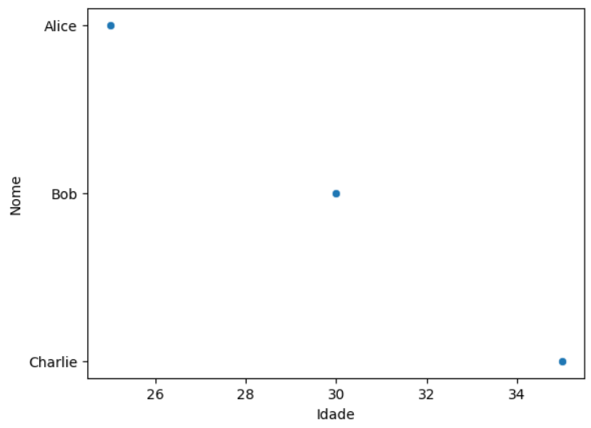

# Documentação sobre Google Colab e Python

## Estrutura da Linguagem Python - Variáveis

No Python, variáveis são contêineres que armazenam dados. Uma das características mais interessantes de Python é sua tipagem dinâmica, o que significa que você não precisa declarar o tipo de uma variável ao criá-la. Em vez disso, o tipo é inferido automaticamente com base no valor atribuído a ela. Existem diferentes tipos de variáveis em Python, cada uma com suas próprias características e usos.

```python
x = 5      # variável do tipo int
y = "Ola"  # variável do tipo string
z = True   # variável do tipo booleana
```

### Variáveis Numéricas

**Inteiro (int):** Representa números inteiros como 1, 100, -5, etc.

```python
idade = 25
```

**Ponto flutuante (float):** Representa números decimais como 3.14, -0.001, etc.

```python
altura = 1.75
```

**Complexo (complex):** Representa números complexos no formato a + bj.

```python
num_complexo = 3 + 4j
```

### Variáveis de Texto

**String (str):** Representa texto.

```python
nome = "Maria"
```

### Variáveis Lógicas

**Booleano (bool):** Representa valores lógicos Verdadeiro (True) ou Falso (False).

```python
tem_carro = True
```

### Variáveis Sequenciais

**Tupla (tuple):** Uma sequência ordenada e imutável de itens.

```python
coordenadas = (10, 20)
```

**Conjunto (set):** Uma coleção não ordenada e sem duplicatas de itens.

```python
letras_unicas = {'a', 'b', 'c', 'd'}
```

### Variáveis de Sequência de Bytes

**Byte (bytes):** Representa uma sequência imutável de bytes.

```python
dados = b'\x48\x65\x6c\x6c\x6f'
```

**Bytearray (bytearray):** Semelhante ao tipo bytes, mas mutável.

```python
dados_mutaveis = bytearray(b'Python')
```

## Estrutura da Linguagem Python – Diferenças entre Vetores / Listas / Dicionários

No Python, a principal diferença entre vetores e listas é que os vetores são uma estrutura de dados homogênea, o que significa que todos os elementos do vetor devem ser do mesmo tipo de dados (por exemplo, todos inteiros, todos floats, todos strings, etc.). Já as listas são heterogêneas, o que significa que podem conter elementos de diferentes tipos de dados (por exemplo, inteiros, floats, strings, objetos, etc.).

Vetores são mais eficientes em termos de memória e desempenho para operações matemáticas e manipulações de grandes conjuntos de dados, enquanto listas são mais flexíveis e versáteis do que os vetores, pois permitem a adição, remoção e alteração de elementos de forma dinâmica.

As listas são ótimas para armazenar coleções ordenadas de itens onde a posição é importante, enquanto os dicionários são ideais para mapear chaves únicas a valores, proporcionando acesso rápido e eficiente aos dados associados a essas chaves.

### Vetores

É uma estrutura que armazena uma coleção ordenada de elementos. Cada elemento é identificado por um índice, que começa em 0 para o primeiro elemento, 1 para o segundo e assim por diante. No exemplo abaixo, criamos um vetor chamado “vetor” com os valores de 1 a 5.

```python
# Cria um vetor com os valores de 1, 2, 3, 4 e 5
vetor = [1, 2, 3, 4, 5]
```

Podemos acessar cada elemento do vetor utilizando seu índice. Por exemplo, para acessar o primeiro elemento, utilizamos “vetor[0]”. Podemos também adicionar e remover elementos de um vetor utilizando o método “append” para uma única adição ou então “extend”, para adicionar mais de um elemento por vez. Para remover um elemento específico do vetor utiliza-se o método “remove” ou então a palavra-chave “del” para remover pelo número do índice desejado.

```python
# Cria um vetor com os valores 1, 2, 3, 4 e 5
vetor = [1, 2, 3, 4, 5]

# Adiciona o elemento 6 no vetor
vetor.append(6)

# Adiciona os elementos 7, 8 e 9
vetor.extend([7, 8, 9])

# Remove o elemento 3
vetor.remove(3)

# Remove o elemento 2 (valor 2) do vetor pelo seu índice
del vetor[1]
```

### Listas

Uma lista é uma maneira de organizar e armazenar informações em uma sequência ordenada, onde cada item tem uma posição única e pode ser acessado facilmente quando necessário. As operações em listas podem ser menos eficientes em termos de desempenho quando comparadas a operações em vetores, especialmente para grandes conjuntos de dados.

Neste exemplo, foi criada uma lista de compras inicial com alguns itens. Em seguida, adicionados novos itens à lista utilizando o método extend(), removemos um item específico com remove(), e finalmente ordenamos a lista em ordem alfabética com sort(). O resultado é a lista de compras atualizada e ordenada:

```python
# Cria uma lista de compras
lista_compras = ["Maçã", "Banana", "Leite", "Pão", "Queijo"]

# Adiciona novos itens à lista
novos_itens = ["Ovos", "Cereais", "Iogurte"]
lista_compras.extend(novos_itens)

# Remove um item da lista
lista_compras.remove("Pão")

# Ordena a lista em ordem alfabética
lista_compras.sort()

# Exibe a lista
print("Lista de compras:", lista_compras)
```

### Dicionários

São uma coleção que guarda valores multidimensionais para cada índice, diferente de uma lista encadeada, que guarda apenas um valor por vez. É uma coleção que consiste em chaves e valores correspondentes, quase como uma associação entre dois conjuntos. É também uma coleção ordenada, mutável, indexada e que não possibilita a inserção de elementos repetidos. Estrutura muito poderosa para superar limitações clássicas das listas encadeadas, portanto, uma coleção muito utilizada.

Neste exemplo, o dicionário “traduções” contém os termos "casa", "carro" e "gato", cada um mapeado para um sub-dicionário que armazena suas traduções em português, inglês e espanhol. O exemplo final demonstra como acessar as traduções de uma palavra específica no dicionário e exibi-las para as três línguas diferentes. Por exemplo, se você quiser a tradução da palavra "casa", o programa exibirá "casa" em português, "house" em inglês e "casa" em espanhol.

```python
# Dicionário de tradução
traducoes = {
    "casa": {
        "portugues": "casa",
        "ingles": "house",
        "espanhol": "casa"
    },
    "carro": {
        "portugues": "carro",
        "ingles": "car",
        "espanhol": "coche"
    },
    "gato": {
        "portugues": "gato",
        "ingles": "cat",
        "espanhol": "gato"
    }
}

# Exemplo de uso do dicionário
palavra = "casa"
print("Em português:", traducoes[palavra]["portugues"])
print("Em inglês:", traducoes[palavra]["ingles"])
print("Em espanhol:", traducoes[palavra]["espanhol"])
```

Abaixo, exemplos de métodos nativos do Python para o uso em dicionários:

- `Keys`: esse método retorna todas as chaves do dicionário em uma lista.
- `Values`: retorna todos os valores do dicionário em uma lista.4
- `Items`: etorna todos os valores e chaves relacionadas.
- `HasKey`: procura se existe uma chave dentro do dicionário Python.
- `Clear`: remove todos os elementos do dicionário.
- `Get`: pega o conteúdo de cada chave.
- `Update`: serve para concatenar dicionários e atualizar os elementos de um com componentes de outro.
- `4Pop`: remove um elemento especificado do dicionário e o retorna.
- `Len`: usado para descobrir o tamanho de uma coleção do tipo dicionário.
- `Copy`: copia os elementos de um dicionário para inserir em outro.
- `fromkeys()`: cria um novo dicionário com as chaves especificadas como parâmetro.

## Estrutura da Linguagem Python – Estruturas Condicionais

As estruturas condicionais na programação servem para fazer com que o programa tome decisões com base em certas condições. É como dar instruções ao computador para que ele faça algo apenas se uma determinada situação for verdadeira. Por exemplo, imagine que você está escrevendo um programa para verificar se um número é maior que 10. Com uma estrutura condicional, você pode dizer ao programa para fazer uma coisa se o número for maior que 10 e outra coisa se não for. Assim, o programa pode se adaptar e agir de maneira diferente dependendo da situação.

As estruturas condicionais em Python nos permitem tomar decisões com base em condições específicas. As mais comuns são o “if”, “elif” (abreviação de "else if") e “else”. O “if” verifica uma condição e executa um bloco de código se a condição for verdadeira. O “elif” é uma extensão do “if” e permite verificar condições adicionais. Já o “else” é usado para executar um bloco de código quando todas as condições anteriores são falsas.

### Uso do `if`

```python
if condicao: # bloco de código se a condição for verdadeira
else: # bloco de código se a condição for falsa
```

### Uso do `elif`

```python
if condicao1: # bloco de código se a condição1 for verdadeira
elif condicao2: # bloco de código se a condição2 for verdadeira
else: # bloco de código se nenhuma das condições anteriores for verdadeira
```

Abaixo, um exemplo prático de uso desta estrutura condicional em Python, onde estamos atribuindo uma nota a um aluno com base em suas pontuações. Se a nota for igual ou superior a 90, o aluno recebe uma nota A. Se estiver entre 80 e 89, é uma nota B, e assim por diante. Se a nota for inferior a 60, o aluno recebe uma nota F e é incentivado a estudar mais.

```python
nota = 85

if nota >= 90:
    print("Você tirou uma nota A!")
elif nota >= 80:
    print("Você tirou uma nota B.")
elif nota >= 70:
    print("Você tirou uma nota C.")
elif nota >= 60:
    print("Você tirou uma nota D.")
else:
    print("Você tirou uma nota F. Estude mais!")
```

## Estrutura da Linguagem Python – Estruturas de Repetição

As estruturas de repetição na programação são recursos usados para repetir um bloco de código seguindo certas condições. É como dizer para o computador fazer a mesma coisa enquanto a condição for verdadeira ou falsa.

No python existem duas estruturas de repetição, o for e o while. O for é usado para percorrer ou iterar uma sequência de dados executando uma instrução para cada item percorrido. Já o while é usado para que o bloco seja repetido enquanto certa condição for satisfeita.

### Uso do `for`

```python
for <nome variável> in <iterável>
# bloco de código
else:
# bloco de código
```

### Uso do `while`

```python
while <condição>:
# bloco de código
else:
# bloco de código
```

Abaixo, um exemplo simples de uso para ambas as repetições onde em ambos os casos, o “else” é opcional.

```python
vetor = [1, 2, 3, 4, 5]

for item in vetor:
    print(item)
    # Após percorrer todos os itens, irá para o else
else:
    print("Todos os números já foram mostrados")

contador = 0

while contador < 20:
    contador += 1
    print(contador)
    # Após percorrer todos os itens, irá para o else
else:
    print("Fim da contagem")
```

Em muitos casos, dentro dos laços, é usado “if” para que quando chegar em certa condição o laço execute algo diferente como o break, pass ou continue.

## Funções:

Uma função é um bloco de código que realiza uma tarefa específica. Ela é definida com a palavra chave “def”. Elas são práticas para evitar que o mesmo código seja repetido várias vezes. Elas cumprem objetivos específicos definidos pelo usuário ou pelo sistema recebendo ou não parâmetros.

### Sintaxe da função:

```python
def nome da função (parâmetro):
    # bloco de código
    return
```

Abaixo, um exemplo de função que soma todos os valores de um vetor e retorna a média deles.

```python
def calcular_media(lista):
    """This function calculates the average of a list of numbers.

    Args:
        lista: A list of numbers.

    Returns:
        The average of the numbers in the list.
    """
    total = sum(lista)
    media = total / len(lista)
    return media

numeros = [1, 2, 3, 4]
num1 = calcular_media(numeros)

print(num1)
```

### Importação e uso de bibliotecas

A importação de bibliotecas permite ao usuário uma ampla variedade de recursos, como por exemplo algoritmos de aprendizado de máquina, visualização de dados, manipulação de arquivos, entre outros.

Para fazer uso desse conteúdo precisamos usar a sintaxe “ import <nome_da_biblioteca>”, assim podendo usar qualquer função que está disponível na biblioteca.

Também é possível apelidar o nome da biblioteca usando “as” logo após importar ela.

### Gerenciador de Pacotes

O PIP é um gerenciador de pacotes que permite buscar, instalar, atualizar e desinstalar bibliotecas de forma eficiente. Para utilizar basta usar o comando “pip install <nome_do_pacote>.” dentro do terminal.

#### Outras funções:

`pip install --upgrade nome_do_pacote` para atualizar um pacote;

`pip uninstall nome_do_pacote` para desinstalar um pacote;


### Referências

https://docs.python.org/pt-br/3/tutorial/introduction.html#lists

https://www.hashtagtreinamentos.com/estruturas-de-repeticao-python?psafe_param=1&gad_source=1&gclid=Cj0KCQjw6PGxBhCVARIsAIumnWYAHqcheTC9TFembdE5eLAiGco3fX21EcMdTK7yTT68Bgelz2_FOWIaAieyEALw_wcB

https://awari.com.br/vetor-python-aprenda-a-utilizar-a-linguagem-de-programacao-para-manipular-vetores/#:~:text=Um%20vetor%20em%20Python%20%C3%A9,manipular%20conjuntos%20de%20valores%20relacionados.

https://blog.somostera.com/desenvolvimento-web/dicionario-python#:~:text=Os%20dicion%C3%A1rios%20Python%20s%C3%A3o%20uma,em%20um%20programa%20de%20software.

https://pythonacademy.com.br/blog/estruturas-condicionais-no-python

https://docs.python.org/pt-br/3/tutorial/controlflow.html

https://pythonacademy.com.br/blog/estruturas-de-repeticao

https://ebaconline.com.br/blog/funcoes-python

https://awari.com.br/aprenda-python-do-zero-importando-modulos-e-bibliotecas/#:~:text=Importar%20m%C3%B3dulos%20e%20bibliotecas%20em%20Python%20permite%20dividir%20o%20c%C3%B3digo,%2C%20tornando%2Do%20mais%20escal%C3%A1vel.

https://dev.to/iugstav/python-imports-e-bibliotecas-42c0

## Características gerais do Python

### O que é Python?

Python é uma linguagem de programação de alto nível, interpretada. Python é conhecida por sua sintaxe simples e legível, por isso é usada tanto por iniciantes quanto por desenvolvedores mais experientes. Ela suporta diversos paradigmas da programação, dentre entre programação orientada e objetos, funcional e procedural.

### Principais características:

- Sintaxe simples e legível, facilitando escrita e leitura do código.
- Suporta diversos paradigmas de programação.
- Uma grande quantidade de bibliotecas e frameworks, aumentando a produtividade.
- Portabilidade, sendo executável em diversas plataformas.
- Comunidade ativa e documentação completa.

### Prós:

- Facilidade para aprender, por conta de uma sintaxe mais simples, torna o aprendizado mais simples, por isso é uma escolha excelente para iniciantes.
- A grande quantidade de bibliotecas e frameworks ajuda os desenvolvedores a resolverem problemas de forma rápida e eficiente.
- Versatilidade, python pode ser utilizado em diversas áreas, desde desenvolvimento web, cientifico, automações e até machine learning;
- Open Source: python é open source então você pode baixar o código fonte, modificar e usar sua versão personalizada

### Contras:

- Desempenho, por conta do ser uma linguagem interpretada pode ter um desempenho abaixo de outras linguagem por exemplo c++ que é uma linguagem de baixo nível.
- O tamanho do código comparado com outras linguagens pode ser maior para realizar a mesma tarefa.
- Dependências externas, em projetos mais complexos, o gerenciamento de dependências externas pode se tornar complicado;

### Por que usar Machine Learning em Python?

- Ecossistema robusto: por conta de todas os frameworks e bibliotecas populares para machine learning, como TensorFlow, Scikit-learn, Keras e PyTorch, que tornam o desenvolvimento de modelos de machine learning mais eficiente.
- Facilidade de prototipagem: Python é conhecido por sua facilidade de prototipagem, permitindo que os cientistas de dados experimentem rapidamente com diferentes algoritmos e técnicas de machine learning.
- Grande comunidade e recursos: python tem uma comunidade ativa de cientistas de dados e desenvolvedores de machine learning, por conta disso existe uma grande quantidade de recursos disponíveis.
- Integração com outras tecnologias: Python pode ser integrado com outras tecnologias como bando de dados, ferramentas de visualização de dados, e sistemas de produção, tornando-o uma escolha conveniente e poderosa para desenvolvimento de machine learning.

### Fontes:

https://aws.amazon.com/pt/what-is/python/

https://ltecnologia.com.br/blog/vantagens-e-desvantagens-da-linguagem-python/

https://www.linkedin.com/pulse/linguagem-python-3-pr%C3%B3s-e-contras-leia-o-artigo-at%C3%A9-fim-antonio-m--knenf/

## Gerenciador de Pacotes

### O que é o PIP?

O PIP ou "Pip Installs Packages" (Pip Instala Pacotes). É o sistema de gerenciamento de pacotes padrão para Python. Ele permite instalar, atualizar e remover bibliotecas de código Python facilmente.

### Como usar o PIP?

Para instalar um pacote, basta abrir o terminal ou prompt de comando e usar o comando pip install nome_do_pacote. Por exemplo, para instalar o pacote numpy, você digitaria pip install numpy. Para atualizar um pacote, você pode usar pip install --upgrade nome_do_pacote. E para remover um pacote, o comando é pip uninstall nome_do_pacote.

## Bibliotecas Python

Em Python, uma biblioteca (também conhecida como módulo ou pacote) é um conjunto de funçoes, classes e constantes escritas por algum desenvolvedor que podem ser importadas e utilizadas em seu código para realizar tarefas específicas. As bibliotecas são criadas para facilitar o desenvolvimento de software, permitindo que os desenvolvedores reutilizem o código ja existente em vez de escrever tudo do zero.

### 1. Pandas

O pandas é uma biblioteca Python utilizada para manipulação e análise de dados. Ela fornece estruturas de dados poderosas, como DataFrames, e ferramentas para limpeza, transformação e análise de dados.

```python
import pandas as pd

data = {'Nome': ['Alice', 'Bob', 'Charlie'],
        'Idade': [25, 30, 35]}
df = pd.DataFrame(data)

print(df.head())
```

> Resultado:
> | | Nome | Idade |
> |---|---------|-------|
> | 0 | Alice | 25 |
> | 1 | Bob | 30 |
> | 2 | Charlie | 35 |

Neste exemplo:

- Importamos a biblioteca pandas
- É Criando um DataFrame chamado data
- Imprime as primeiras linhas do DataFrame

### 2. NumPy

NumPy é uma biblioteca fundamental para computação científica em python. Ela oferece suporte a arrays multidimensionais e funções matemáticas para operações eficientes.

```python
import numpy as np

arr = np.array([1, 2, 3, 4, 5])

print(np.mean(arr))
```

> Resultado:
>
> ```
> 3.0
> ```

Neste Exemplo:

- Importamos a biblioteca numpy
- É criando um array NumPy
- Mostra na tela a média dos elementos do array

### 3. SciPy

SciPy é uma bibliotec que estende as capacidades do NumPy com funções para otimização, álgebra linear, integração, interpolação, entre outros.

```python
from scipy import optimize

def func(x):
    return x**2 + 5*x + 6

result = optimize.minimize(func, x0=0)
print(result.x)
```

> Resultado:
>
> ```
> [-2.50000002]
> ```

Neste Exemplo:

- Importamos a biblioteca scipy
- Definimos uma função para otimização
- Encontramos o mínimo da função
- Mostramos na tela

### 4. Seaborn

Seaborn é uma biblioteca de visualização de dados baseada na famosa biblioteca matplotlib. Ela simplifica a criação de gráficos estatísticos atrativos e informativos. (Para utilização precisa importar também a matplotlib)

```python
import seaborn as sns
import matplotlib.pyplot as plt

sns.scatterplot(x='Idade', y='Nome', data=df)
plt.show()
```

> Resultado:
>
> 

Neste Exemplo:

- Impostamos as bibliotecas seaborn e matplotlib
- Criamos um gráfico de dispersão com Seaborn
- Mostramos na tela o Gráfico

### 5. Scikit-learn (sklearn)

Scikit-learn é uma biblioteca de aprendizado de máquina que oferece ferramentas simples e eficientes para análise preditiva de dados. Ela inclui algoritmos de classificação, regressão, clustering, entre outros.

```python
from sklearn.model_selection import train_test_split
from sklearn.linear_model import LinearRegression
import numpy as np

np.random.seed(0)
X = 2 * np.random.rand(100, 1)
y = 4 + 3 * X + np.random.randn(100, 1)

X_train, X_test, y_train, y_test = train_test_split(X, y, test_size=0.2, random_state=42)

model = LinearRegression()

model.fit(X_train, y_train)

predictions = model.predict(X_test)

print(predictions)
```

> Resultado:
>
> ```
> [[ 8.3476823 ]
> [ 4.81662104]
> [10.04607379]
> [ 8.21710217]
> [ 8.19395067]
> [ 8.2839789 ]
> [ 6.96622591]
> [ 6.10804438]
> [ 8.94126619]
> [ 7.48852934]
> [ 8.8601208 ]
> [ 5.78851984]
> [ 7.82362983]
> [ 7.60586977]
> [ 6.11154761]
> [ 6.74001543]
> [ 5.89767238]
> [ 4.92517791]
> [ 7.60354103]
> [ 8.83665886]]
> ```

Neste exemplo:

- Importamos as bibliotecas sklearn.model_selection, sklearn.linear_model, sklearn.metrics e numpy
- Os dados de exemplo são gerados usando np.random.rand().
- Os dados são divididos em conjuntos de treinamento e teste usando train_test_split().
- Um modelo de regressão linear é criado usando LinearRegression().
- O modelo é treinado com os dados de treinamento usando fit().
- Previsões são feitas com os dados de teste usando predict().
- As previsões são impressas na tela.
