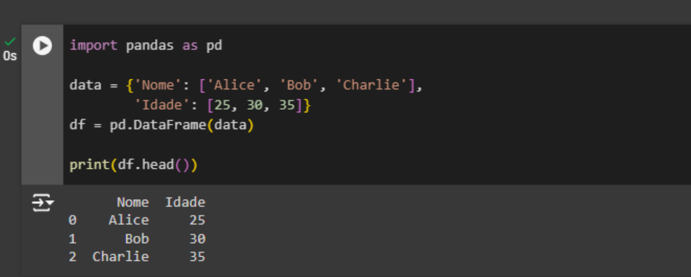
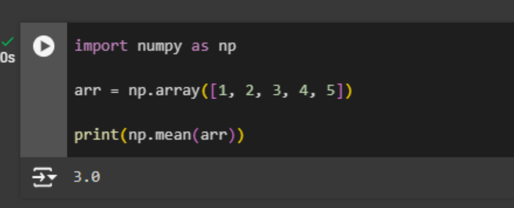
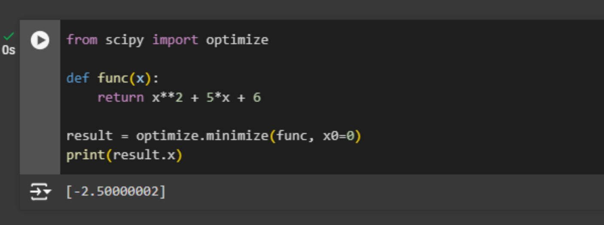
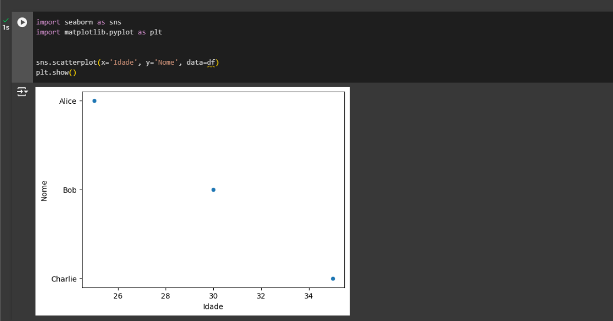
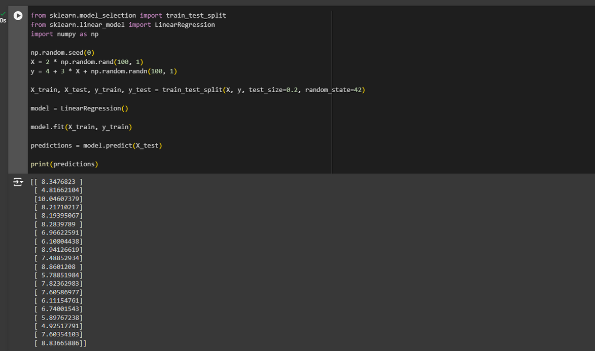

# Documentação sobre Google Colab e Python

## Gerenciador de Pacotes

### O que é o PIP?

O PIP ou "Pip Installs Packages" (Pip Instala Pacotes). É o sistema de gerenciamento de pacotes padrão para Python. Ele permite instalar, atualizar e remover bibliotecas de código Python facilmente.

### Como usar o PIP?

Para instalar um pacote, basta abrir o terminal ou prompt de comando e usar o comando pip install nome_do_pacote. Por exemplo, para instalar o pacote numpy, você digitaria pip install numpy. Para atualizar um pacote, você pode usar pip install --upgrade nome_do_pacote. E para remover um pacote, o comando é pip uninstall nome_do_pacote.

## Bibliotecas Python

Em Python, uma biblioteca (também conhecida como módulo ou pacote) é um conjunto de funçoes, classes e constantes escritas por algum desenvolvedor que podem ser importadas e utilizadas em seu código para realizar tarefas específicas. As bibliotecas são criadas para facilitar o desenvolvimento de software, permitindo que os desenvolvedores reutilizem o código ja existente em vez de escrever tudo do zero.

### 1. Pandas

O pandas é uma biblioteca Python utilizada para manipulação e análise de dados. Ela fornece estruturas de dados poderosas, como DataFrames, e ferramentas para limpeza, transformação e análise de dados.

Neste exemplo:

- Importamos a biblioteca pandas
- É Criando um DataFrame chamado data
- Imprime as primeiras linhas do DataFrame

### 2. NumPy

NumPy é uma biblioteca fundamental para computação científica em python. Ela oferece suporte a arrays multidimensionais e funções matemáticas para operações eficientes.

Neste Exemplo:

- Importamos a biblioteca numpy
- É criando um array NumPy
- Mostra na tela a média dos elementos do array

### 3. SciPy

SciPy é uma bibliotec que estende as capacidades do NumPy com funções para otimização, álgebra linear, integração, interpolação, entre outros.

Neste Exemplo:

- Importamos a biblioteca scipy
- Definimos uma função para otimização
- Encontramos o mínimo da função
- Mostramos na tela

### 4. Seaborn

Seaborn é uma biblioteca de visualização de dados baseada na famosa biblioteca matplotlib. Ela simplifica a criação de gráficos estatísticos atrativos e informativos. (Para utilização precisa importar também a matplotlib)

Neste Exemplo:

- Impostamos as bibliotecas seaborn e matplotlib
- Criamos um gráfico de dispersão com Seaborn
- Mostramos na tela o Gráfico

### 5. Scikit-learn (sklearn)

Scikit-learn é uma biblioteca de aprendizado de máquina que oferece ferramentas simples e eficientes para análise preditiva de dados. Ela inclui algoritmos de classificação, regressão, clustering, entre outros.

Neste exemplo:

- Importamos as bibliotecas sklearn.model_selection, sklearn.linear_model, sklearn.metrics e numpy
- Os dados de exemplo são gerados usando np.random.rand().
- Os dados são divididos em conjuntos de treinamento e teste usando train_test_split().
- Um modelo de regressão linear é criado usando LinearRegression().
- O modelo é treinado com os dados de treinamento usando fit().
- Previsões são feitas com os dados de teste usando predict().
- As previsões são impressas na tela.
